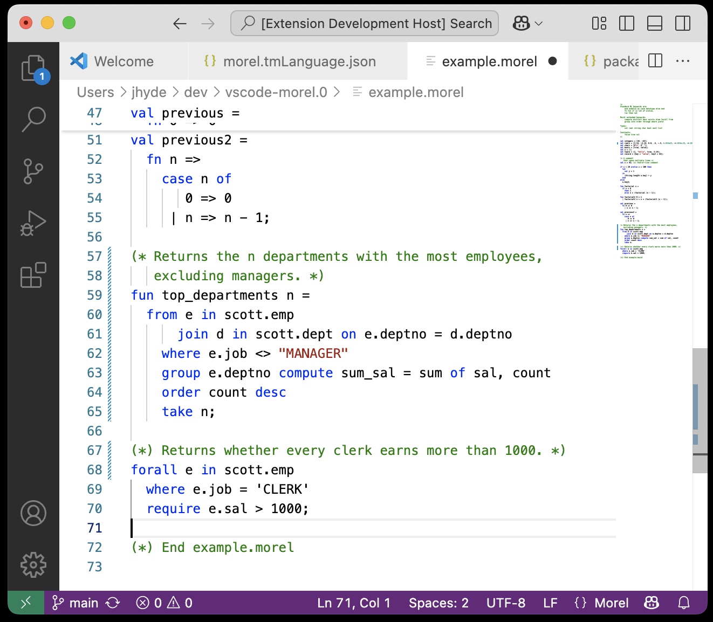

<!--

Licensed to Julian Hyde under one or more contributor license
agreements.  See the NOTICE file distributed with this work
for additional information regarding copyright ownership.
Julian Hyde licenses this file to you under the Apache
License, Version 2.0 (the "License"); you may not use this
file except in compliance with the License.  You may obtain a
copy of the License at

http://www.apache.org/licenses/LICENSE-2.0

Unless required by applicable law or agreed to in writing,
software distributed under the License is distributed on an
"AS IS" BASIS, WITHOUT WARRANTIES OR CONDITIONS OF ANY KIND,
either express or implied.  See the License for the specific
language governing permissions and limitations under the
License.

-->

# Language support for Morel

Provides a
[VSCode language extension](https://code.visualstudio.com/api/language-extensions/overview)
for the [Morel](https://github.com/hydromatic/morel) language.

## Quick start

1. Install the extension

## Status

Done:
 * Create project
 * Enable CI
 * Syntax highlighting

To do:
 * Dependabot
 * Bracket completion
 * Formatting
 * Installation instructions
 * Make a release
 * Add to VSCode marketplace

## More information

* License: [Apache Software License, Version 2.0](LICENSE)
* Author: [Julian Hyde](https://github.com/julianhyde)
* Source code: https://github.com/hydromatic/vscode-morel
* Issues: https://github.com/hydromatic/vscode-morel/issues
* [Release notes and history](HISTORY.md)
* [HOWTO](HOWTO.md)
